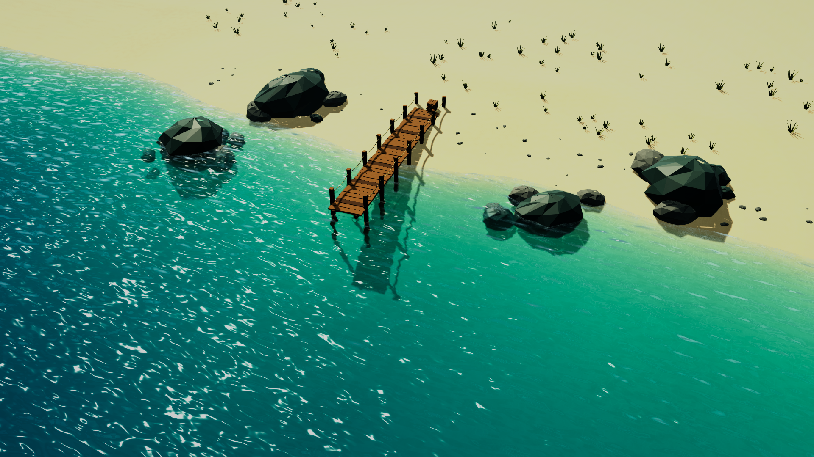
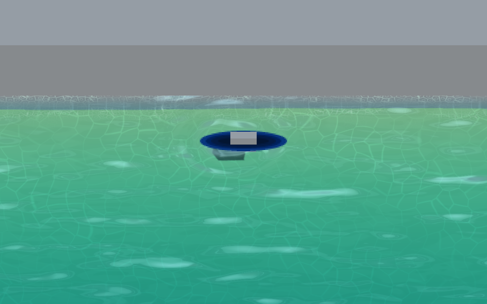

# 海の描画と調整

Unity 6000.6 / URP 17.6 向けのHD-2D海面

## 開くシーン

- `Assets/_Project/Scenes/FishingStage.unity` — 既存の釣り場に適用済み
- `Assets/_Project/Scenes/CampStage.unity` — 既存のキャンプに適用済み
- `Assets/_Project/Scenes/Develop/OceanLookDev.unity` — 砂浜、岩、桟橋と午後の光で海面を確認する独立シーン

確認用シーンを単独で開いて Play すると波と光の動きを確認できる
ゲーム用シーンのカメラ、太陽、当たり判定、魚影の出現処理、音源は元の設定を維持している

## 構成

`Sea/Ocean Visuals` の下に `Water Surface` と `Submerged Sand` がある
元の `sea` は MeshRenderer だけ無効化し、BoxCollider を残している
海面はワールド Y = -1、最大上下変位の設定値は 0.022m

海面は4つの方向波と細波をGPUで合成する
浅瀬は屈折とRGB別の光の吸収で水底を透かし、深部は青へ変化する
深度差から岩や突堤の接触泡を作り、細かなセル模様を泡と海底の集光に使う
太陽の鏡面反射、視線角度に応じた空と反射プローブの反射を合成する

メッシュは生成済みアセットを共有し、環境の波にCPUメッシュ更新は不要
魚影が出現したときだけ、魚影用の共有波紋フィールドを生成する
ゲーム用海面の頂点数は FishingStage 25,351、CampStage 10,201
海面1パスと水底の描画に加え、カメラのOpaque/Depthテクスチャ取得が必要

## Materialを調整する

共有Material: `Assets/_Project/Materials/Ocean/M_HD2DOcean.mat`
FishingStageとCampStageで共有し、両シーンへ同時に反映される
OceanLookDevは[透き通る光の調整](TranslucentLighting.md)用に複製した専用Materialを使う
シーンごとに雰囲気を変える場合はMaterialを複製して海面へ割り当てる

| Inspectorの項目 | 用途 |
| --- | --- |
| Shallow jade / Deep teal | 浅い場所と深い場所の色 |
| RGB absorption per metre | 水中の光の吸収量、値が小さいほど水底が見える |
| Maximum wave height / Wave speed | 波の高さとアニメーション速度 |
| Ripple scale / Ripple normal strength | 中程度の波の細かさと反射のゆがみ |
| Capillary wave frequency / Capillary wave slope | 細かなきらめきの密度と強さ |
| Fish ripple slope strength | 魚影が起こす波による反射・屈折の変化 |
| Fish ripple crest foam | 魚影の波頭に加えるごく薄い泡 |
| Shore world Z | 主な岸線、現在は -7 |
| Shore foam width / Intersection foam depth | 岸に寄せる泡の帯と地形に触れる泡の幅 |
| Foam cells per metre | 泡の模様の細かさ |
| Sun glitter intensity / Sun reflection roughness | 太陽反射の強さと広がり |
| Underwater caustics / Caustics scale | 海底の光の模様の強さと細かさ |

太陽の反射はライトと視線の角度に依存する
確認用シーンは反射が見える向きに太陽とカメラを配置している
既存ゲームの太陽方向は変更していないため、同じMaterialでも反射の強さは異なる

## 描画順の要点

- CameraのURP設定は Depth Texture / Opaque Texture を `On` に固定する
- `Default_Forward_Renderer` の Copy Depth Mode は `After Opaques` にする
- このRendererはプロジェクトの全6品質設定で共有している
- 海面は Queue 2990、ZWrite Off、背景の屈折色をシェーダー内で一度だけ合成する
- 魚影は水面より後から描画するため、従来の固定高さのまま表示できる
- 魚影の波紋は海面シェーダーへ合成し、海の光・反射・屈折と一緒に描画する
- 透視投影と平行投影、Fog有効・無効の両方を扱う

Copy Depth Modeを `After Transparents` に戻すと、海の描画時点で水底の深度が使えず、水深色や接触泡が正しく出なくなる
屈折はOpaqueテクスチャを使うので、透明な魚影は屈折対象に含まれない
空とプローブの反射を使用し、動くオブジェクトの平面鏡反射は行わない

## 魚影の移動と波紋

FishingStageの4つのスポットへ適用済み
`FishingSpot` が実際のXZ移動距離と速度を `FishShadow` → `FishRippleEmitter` へ渡す
出現時は円形の波、移動時は進行方向の後方へ少し強く残る波を発生させる
波の中心は発生地点へ固定し、複数の波頭が広がりながら減衰する
魚影が停止・非表示になっても発生済みの波は自然に消え、ポーズ中は魚影と一緒に停止する

上の画像はFishingStageで波の時刻を固定した描画比較用キャプチャ
[同じ視点・同じ時刻で波紋を無効にした画像](fish-ripple-baseline.png)と比較できる
共有海面Materialの `Fish ripple slope strength = 2.2`、`Fish ripple crest foam = 0.22` に調整し、既存の細波の中でも魚影の波を読み取りやすくしている

魚影Prefabの `FishRippleEmitter` で調整する

| 項目 | 初期値 | 用途 |
| --- | --- | --- |
| Material | M_FishRippleField | 波紋専用の高さ・勾配を生成するMaterial |
| Duration | 3.2秒 | 波が広がって消えるまでのゲーム時間 |
| Strength | 0.028m | 法線計算に使う波の基準高さ、大きさと速度でも変化 |
| Minimum Interval | 0.18秒 | 同じ魚影の波頭が過密になるのを防ぐ最小間隔 |

スポット側の `Ripple Distance` は引き続き移動距離の閾値として使う（初期値0.12m）
`Movement Distance = 0` なら出現波だけを出し、停止中の移動波は追加しない
波紋は水面法線を変化させるため、魚影の当たり判定や釣り開始判定には影響しない
小さな波を粗い海面メッシュで潰さないよう、波紋の法線はピクセル単位で評価する
魚影による頂点変位や物理流体シミュレーションは行わない

`OceanRippleField` は全魚共通の64波の固定バッファと、512×512のARGBHalfテクスチャ（約2MiB）を再利用する
波がある間だけ小さなQuadをGPUで加算描画し、海面は合成済みテクスチャを一回参照する
毎フレームのメッシュ生成と魚ごとのLineRendererは使わない
上限を超えた場合は最も古く登録した波から置き換える
最初の発生元シーンに管理オブジェクトを配置し、シーン破棄時にGPU資源とグローバル参照を解放する
現在の共通の水平海面を対象とし、高さの異なる複数水域を同時に扱う構成にはしていない
旧 `FishRipple.mat` は既存アセットとの互換性のため残し、魚影Prefabは新しい `M_FishRippleField.mat` を参照する

## エディターツール

`Tools > Ocean > Apply to Active Scene`

既存ステージと同様の有効な `sea` BoxColliderを持つシーンへ海面を配置する
処理後はシーンを保存する
元の海と地形は無回転・親の等倍を前提とする
配置済みなら重複追加を止める
Undoで配置を戻した後に再実行すると、生成済みメッシュのGUIDを保って再利用する
生成メッシュのアセット自体はUndo後も残る

`Tools > Ocean > Create Coastal Look Development Scene`

調整用の海岸シーンを新規保存してSceneAssetを選択する
開いていたシーンへ戻るため、生成したSceneAssetを単独で開いて確認する
既存の確認シーンや手作業の調整を上書きせず、再実行時は別名で保存する

## 検証

Unity上で6品質設定、透視・平行投影、Fog有効・無効の描画チェックを実施し、海面シェーダーのエラーなし
FishingStageのPlay Modeで魚影4体と波紋の描画を確認
Windows x64 Developmentビルドは成功
ビルド全体には既存のFMODなどの警告があり、実行ファイルではFMODの既存Master.bankが要求するDSP `ThunderStorm` の不足により音声初期化エラーが出る
海の描画確認とは別に、製品ビルドの音声確認にはこのDSPの同梱設定が必要

確認結果は `Logs/sea-validation.json`、Windowsビルド結果は `Logs/sea-build-result.json` に出力
`Logs` と `Build/SeaValidation` はGit対象外
Unityの描画キャプチャは `Logs/sea-preview.png`

魚影連携はPlay Modeで29項目を確認し、4体同時移動、速度と方向、停止、非表示後の減衰、透明状態からの再出現、ポーズ、64波の容量制限、GPU勾配の有限性と描画、破棄時の資源解放が通過
結果は `Logs/ocean-fish-ripple-validation.json`
同じカメラ・時刻で波紋の有無を比較し、海面への反映を画像でも確認した
比較条件と画素差は `Logs/ripple-render-comparison.json`
追加で6品質設定の描画、管理オブジェクト無効化時の波の解除、RenderTexture消失後の再生成を確認し、シェーダーエラーなし
結果は `Logs/ocean-fish-ripple-quality.json`
魚影連携を含むWindows x64 Developmentビルドも成功（エラー0、既存パッケージなどの警告22）
結果は `Logs/fish-ripple-build-result.json`、出力は `Build/FishRippleValidation/Minge.exe`
