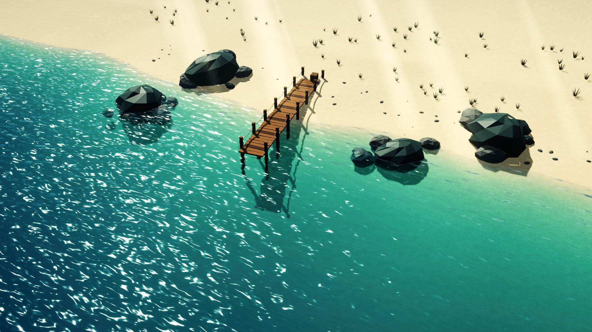

# 海辺の透き通る光

`Assets/_Project/Scenes/Develop/OceanLookDev.unity` に適用した、Octopath Travelerの見た目を参考にした光の演出

淡い金色の斜光、青みを残す影、高輝度だけがにじむBloom、遠景の薄い霧を組み合わせている
海面には確認シーン専用の素材を割り当て、ゲーム用シーンで使う共有素材は保持している
被写界深度は使用していない

## 確認と再適用

適用済みのシーンを保存しているため、開いてGameビューまたはPlay Modeでそのまま確認できる
既定の光設定へ戻したい場合は次の手順で再適用する

1. `OceanLookDev.unity` を単独で開く
2. 編集モードで `Tools > Ocean > Apply Translucent Lighting to LookDev` を実行する
3. シーンを保存し、GameビューやPlay Modeで光と水面を確認する

再適用にはHDR対応のURPが必要で、再生中や複数シーンを開いた状態では実行できない
既存の専用アセットと光線オブジェクトを再利用するため、繰り返し実行しても光線は増えない

再適用すると、このツールが設定する手調整済みの数値は既定値へ戻る
メニューの操作はUndoで取り消せるが、初回に生成したアセットは残る

## 調整する場所

専用フォルダーは `Assets/_Project/Graphics/Ocean/LookDev/TranslucentLighting`

| 対象 | 主な設定 | 既定値 |
| --- | --- | --- |
| `TranslucentCoast.asset` | Bloom Intensity / Threshold / Scatter | 0.48 / 1.12 / 0.72 |
| `TranslucentCoast.asset` | Tonemapping | ACES |
| `M_CoastalLightShaft.mat` | `_Intensity` | 0.20 |
| `M_TranslucentOcean.mat` | `_SunGlintStrength` | 1.45 |
| シーンの太陽 | Intensity | 2.35 |

光線の強さは `M_CoastalLightShaft.mat`、水面のきらめきは `M_TranslucentOcean.mat`、光のにじみと色調は `TranslucentCoast.asset` で調整する
光線の向きや幅は再適用時の太陽とカメラを基準に生成するため、配置を変更した場合は再適用して見た目を確認する

## 光線の仕組みと範囲

8本の透明な光線を1つのメッシュにまとめている
構成は32頂点、16三角形、1つのMeshRendererで、CPUでの毎フレーム更新は追加しない
光の筋の緩やかな変化はシェーダー内で計算する

深度との差で地形との交差部分を薄め、ワールドY = -1以下では光線を消して水中への漏れを抑える
光線の四辺とカメラ付近もフェードさせて板の輪郭を目立ちにくくしている

これはカメラに合わせて配置した平面による演出で、ボリュームレイマーチによる体積光ではない
任意の角度から見ても完全な体積として成立するものではないため、主にこの確認シーンのカメラ位置で調整する
原作の実装技術を再現したものではなく、公式画像の寒暖差、柔らかな光束、水面反射を見た目の参考にしている

## 確認済みの範囲

- 全6品質設定と透視投影・平行投影の組み合わせ、計12条件で描画し、Shaderエラーがないことを確認
- 光線を非アクティブにしてから再適用しても重複しないことを確認
- 再適用のUndoで素材の値とメッシュが復元されることを確認
- Play Modeで表示を確認

検証結果は `Logs/translucent-lighting-validation.json` に出力しているが、LogsはGit管理対象外
プレイヤービルドは未実施

## 公式参考

- [Octopath Traveler II 公式 About・グラフィック](https://www.jp.square-enix.com/octopathtraveler2/about/)
- [Octopath Traveler 0 公式 About・HD-2D](https://www.jp.square-enix.com/octopathtraveler0/about/)
